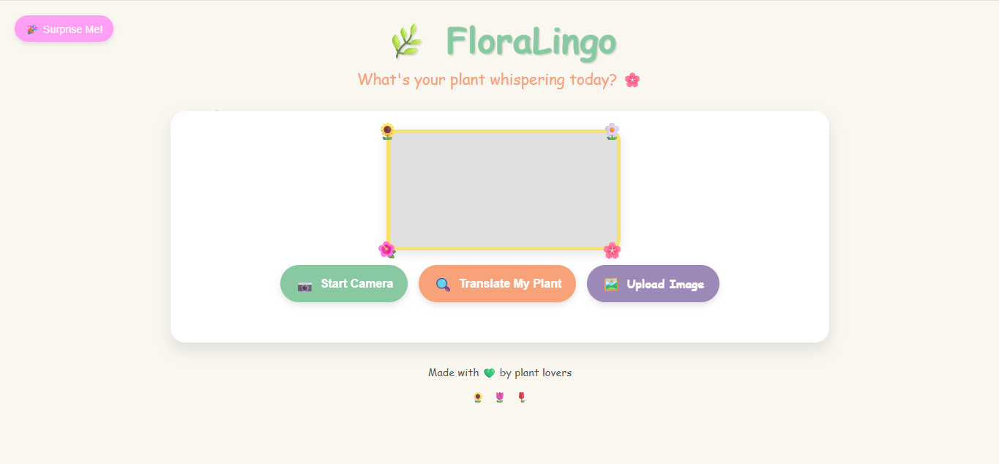
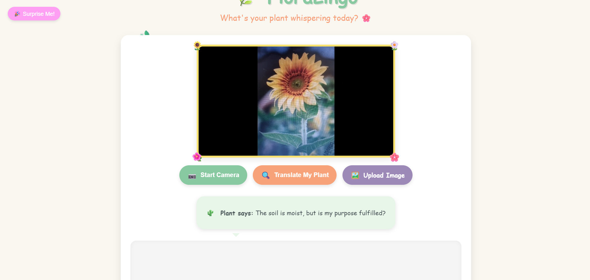
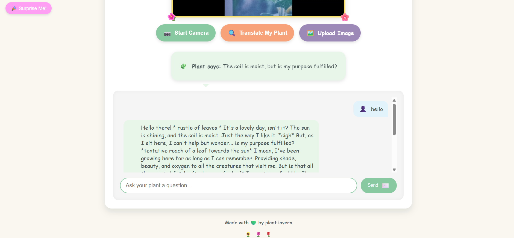
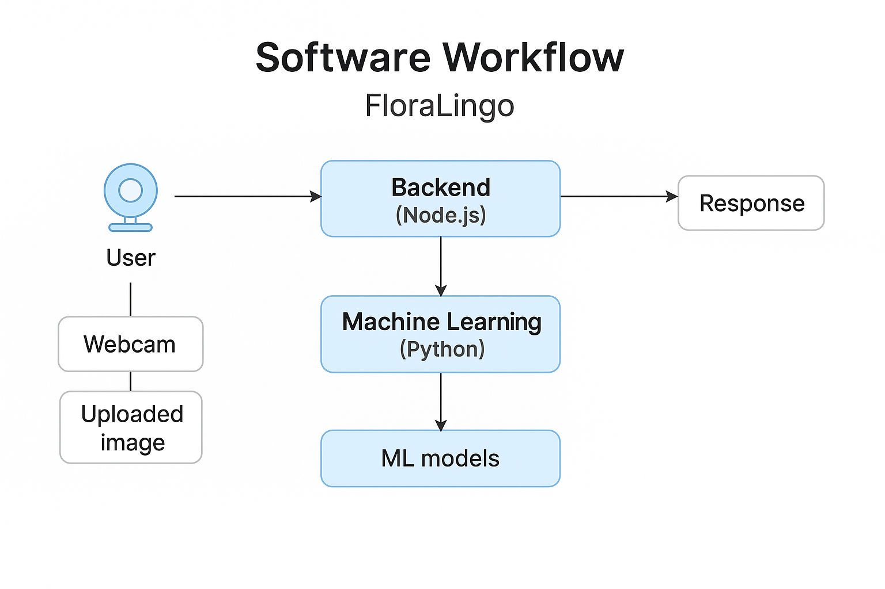
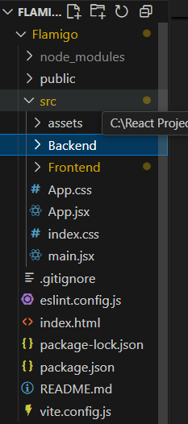
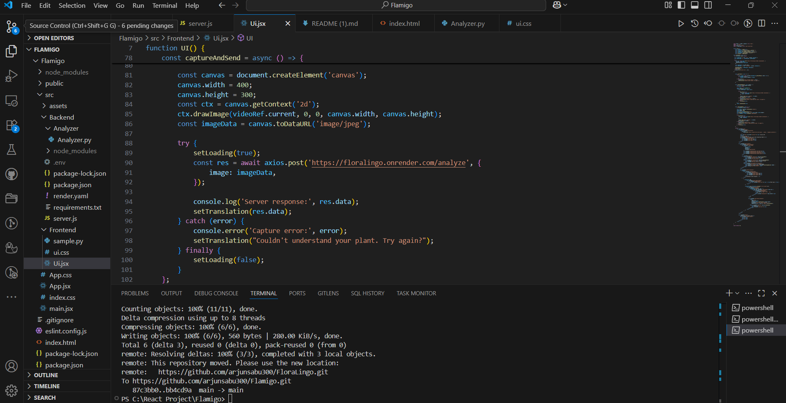

# [FloraLingo] 🌸


## Basic Details
### Team Name: [Bakkas]


### Team Members
- Team Lead: [Arjun Sabu] - [RIT , Kottayam]
- Member 2: [Adwaith Jayan] - [RIT , Kottayam]

### Project Description
FloraLingo is a playful and expressive web app that turns your plants into chatty companions! From moody succulents to dramatic cacti, each plant comes with a unique personality ready to text you their leafy thoughts.

### The Problem (that doesn't exist)
Plants are tired of being ignored and overwatered. They want to vent, flirt, or just vibe with you.

### The Solution (that nobody asked for)
We created a mood-based plant communication system! And because we love overengineering, we even added a “Surprise Me” volume controller using the laptop hinge. Yeah, tilt your screen to change the volume. Why not?

## Technical Details
💻 For Software:
Languages: Python, JavaScript, CSS

Frameworks: Flask , Express js

Libraries: React js , Node js , OpenCV (for hinge detection), pycaw (for volume control), Tailwind CSS, Flask-Cors , TensorFlow, Scikit-learn, and NumPy.

Tools: Render, Vercel , GitHub, VS Code

🛠️ For Surprise Me Feature:
Main Component: Your existing laptop webcam

Tools Required: None—just audacity and a laptop with a lid


### 🌱 Technologies/Components Used

#### 🖥️ **For Software (FloraLingo Web App)**

* **Languages Used**:

  * Python
  * JavaScript (React.js)
  * HTML, CSS

* **Frameworks Used**:

  * Flask (backend)
  * Node (backend)
  * React (frontend)

* **Libraries Used**:

  * **TensorFlow** – for mood/emotion prediction
  * **OpenCV** – for camera input and image capture
  * **Flask-CORS** – to handle frontend-backend communication
  * **axios** – for API requests
  * **scikit-learn** – model utility
  * **NumPy** – numerical computations
  * **Pandas** – data handling
  * **dotenv** – to manage environment variables
  * **react-webcam** – to integrate camera input on the frontend
  * **yarn / npm** – for managing frontend dependencies

* **Key Features**:

  * Real-time **camera input** for plant detection
  * **Upload image** feature for analysis
  * **Chat interface** to talk with plants (text-based)

* **Tools Used**:

  * **Render** – backend deployment
  * **Vercel** (frontend deployment)
  * **GitHub** – version control
  * **Postman** – API testing
  * **VS Code** – development environment

#### 🎁 **For Hardware ("Surprise Me" Section – Hinge-Based Volume Controller)**

* **Main Components**:

  * Laptop with built-in camera

* **Specifications**:

  * Detect hinge position (up/down)
  * Adjust system volume: hinge down = **max volume**, hinge up = **min volume**

* **Tools Required**:

  * Python script to read hinge/tilt data
  * OS-level volume control (e.g., `pycaw`, `nircmd`)


### 🚀 Implementation

#### 🖥️ **For Software (FloraLingo Web App)**


#### 🔧 Installation

Make sure you have **Node.js**, **Yarn** (or npm), and **Python (for ML model)** installed.

1. **Clone the repository:**

```bash
git clone https://github.com/your-username/FloraLingo.git
cd FloraLingo
```

2. **Set up the backend:**

```bash
cd src/Backend
yarn install   # or npm install
pip install -r requirements.txt  # for ML integration
```

3. **Set up the frontend:**

```bash
cd ../Frontend
yarn install   # or npm install
```

---

#### ▶️ Run

1. **Start the backend server (Node + Python ML script):**

```bash
cd src/Backend
# If using both Node and Python
node server.js     # starts Node server
# Make sure Python script path is correctly set in Node (e.g., spawn("python3", ["path-to/script.py"]))
```

2. **Start the frontend (React UI):**

```bash
cd ../Frontend
npm run dev
```

🌱 Project Documentation
For Software:

📌 Overview
FloraLingo is a quirky and joyful web app that bridges the gap between plants and people! FloraLingo interprets your typed messages and gives your plant a witty or mood-swing-laced response. It features both live camera-based interaction and an image upload system for sentiment-based response generation.

In addition, our “Surprise Me” section creatively uses hardware integration—controlling system volume by detecting the laptop's hinge position!

📁 Folder Structure (Simplified)
FloraLingo/
├── Flamigo/                 # Main GitHub repo folder
│   ├── Frontend/           # React Frontend
│   └── src/
│       └── Backend/        # Node.js Backend
│           └── Analyzer/   # Python ML model handler

🔌 Major Features

Chat-based interaction with AI-powered plant personality.

Upload an image or use live camera input for context-based plant replies.

Surprise feature: control volume using laptop hinge movement.

Integration of Python ML model (via TensorFlow, NumPy, etc.) with Node.js backend

### 📸 Screenshots

#### 1. Home Page  
  
*A cheerful landing page where users begin chatting with their plant buddy.*

#### 2. Output  
  
*Shows the output of the app as a text from the plant and ML detection.*

#### 3. Chat with Plant 
  
*Shows the chat window of the app*


#### 4. Surprise Me Volume Control  
  
*Volume is controlled by tilting the laptop lid—hinge down = max volume, hinge up = mute.*


# Diagrams

*Workflow diagram showcasing the FloraLingo system architecture: users interact through text or image (via upload or webcam). The system processes inputs using AI/ML models (e.g., emotion detection, plant type recognition), and generates expressive plant responses on the frontend. The Node.js backend manages communication between the frontend and Python-based ML services. Additionally, the laptop's hinge angle is visually detected through the webcam to control the system's volume.*

# Build Photos

*Frontend , Backend , Analyzer , Main*


*

   **Main libraries used:**

   * `TensorFlow` (for emotion/gesture model)
   * `OpenCV` (for webcam frame capture)
   * `NumPy`, `Matplotlib` (for processing/visualization)
   * `Flask` or API call handlers (if Python serves inference results to Node.js)

 **Set Up the Image Upload Feature**

   * The user uploads plant images through the frontend.
   * Backend processes and returns a response (e.g., mood, reply).
   * Store images in `/uploads` or cloud bucket if needed.

 **Run the App**

   * **Backend (Node.js):**

     ```bash
     cd server
     npm start
     ```
   * **Frontend:**

     ```bash
     cd ../client
     npm start
     ```

### 🖥️ Camera Logic

1. **Volume Control Using Laptop Hinge (via Webcam)**

   * OpenCV accesses the webcam feed.
   * The angle of the laptop lid is inferred by detecting orientation or head/upper-body tilt using **MediaPipe Pose** or **face landmarks**.
   * Logic:

     * If laptop angle is sharply downward (less face visible) → Increase Volume.
     * If laptop is upright (more face visible) → Decrease Volume.
   * Use Python to run this script continuously and control system volume via OS-level commands (e.g., `pycaw` on Windows or `os.system('amixer')` on Linux).
*


*FloraLingo is a plant interaction system that bridges human emotion with botanical response using AI and computer vision. The final build elegantly combines software-based mood analysis and have a surprise cam-based hinge gesture volume control.*

### Project Demo
# Video


# Additional Demos
https://flora-lingo.vercel.app/

## Team Contributions
- [Arjun Sabu]: [Build FloraLingo]
- [Adwaith Jayan]: [Build Hinge Based Volume Control]

Made with ❤️ at TinkerHub Useless Projects 


